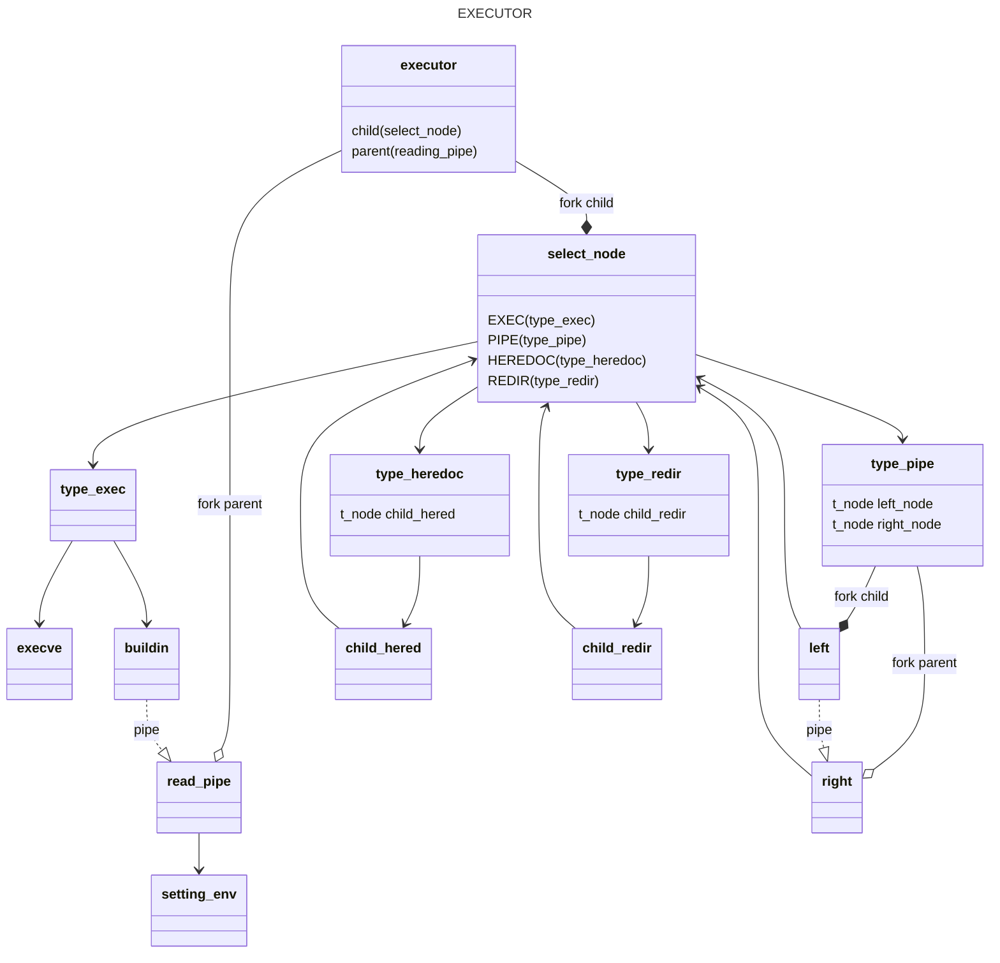

```mermaid

---
title: EXECUTOR
---

classDiagram

class executor{
        child(select_node)
        parent(reading_pipe)
    }

class select_node{
        EXEC(type_exec)
        PIPE(type_pipe)
        HEREDOC(type_heredoc)
        REDIR(type_redir)
    }

class read_pipe{
    }

class setting_env{
    }

class type_exec{
    }

class execve{
    }

class buildin{
    }

class type_pipe{
    t_node left_node
    t_node right_node
    }

class left{
    }

class right{
    }

class type_heredoc{
    t_node child_hered
    }

class child_hered{
    }

class type_redir{
    t_node child_redir
    }

class child_redir{
    }

executor --* select_node : fork child
executor --o read_pipe: fork parent
read_pipe -->setting_env

select_node --> type_exec
type_exec --> execve
type_exec --> buildin

select_node --> type_heredoc
type_heredoc --> child_hered
child_hered --> select_node

select_node --> type_redir
type_redir --> child_redir
child_redir --> select_node

select_node --> type_pipe
type_pipe --*left : fork child
type_pipe --o right : fork parent
left --> select_node
right --> select_node
left ..|> right : pipe

buildin ..|> read_pipe : pipe
```