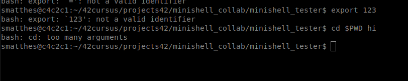
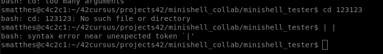
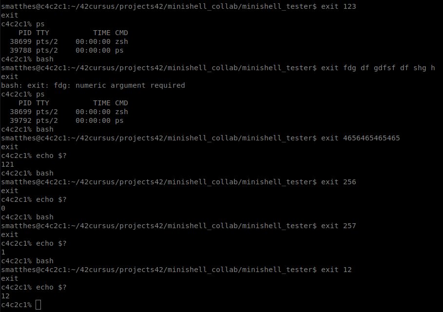

--> exit code Handling 
--> builtins 

- export HELLO=123
- make sure the variable name fullfills all the requirements (only digits, lower/uppercase chars, underscores, dont start withdigit, check again!)
https://www.gnu.org/software/bash/manual/bash.html#Bash-Variables

env | sort | grep -v SHLVL | grep -v ^_  => newlines 

close open fds cat | ls

expander echo raus

set_exit_code()

set_pwd function

built_in exit

signals